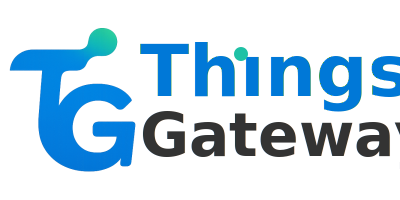



---

<table>
  <tr>
    <td width="100%" align="center">
      
        
      <strong>投出你宝贵的一票</strong> 
      凭投票截图，PRO授权可减免100元
        
      
    </td>
  </tr>
</table>

---

 



## 介绍

ThingsGateway 是一个开源的工业物联网边缘计算网关，致力于为用户提供简单易用、高性能、可扩展的物联网边缘计算解决方案。 

## 项目概览

默认支持net10.0/net8.0。驱动库支持netstandard2.1/netstandard2.0/net4.62/net6.0  

| 项目 | 说明 |
| :-- | :-- |
| [**ThingsGateway.Foundation**](https://gitee.com/ThingsGateway/ThingsGateway.Foundation) | 工具库、驱动接口、驱动实现 |
| [**ThingsGateway.SqlOrm**](https://gitee.com/ThingsGateway/ThingsGateway.SqlOrm) | 轻量级 ORM 库 |
| [**ThingsGateway.AspNetCore**](https://gitee.com/ThingsGateway/ThingsGateway.AspNetCore) | ASP.NET Core 工具与扩展库 |
| [**ThingsGateway.Admin**](https://gitee.com/ThingsGateway/ThingsGateway.Admin) | 后台管理系统 |
| [**Docs**](https://gitee.com/ThingsGateway/Docs) | 说明文档 |
| [**ThingsGateway.Plugin**](https://gitee.com/ThingsGateway/ThingsGateway.Plugin) | 网关插件扩展 |
| [**ThingsGateway**](https://gitee.com/ThingsGateway/ThingsGateway) | 工业网关平台 |

## 文档

[官网地址](https://thingsgateway.cn/)

## 演示

[演示地址](https://demo.thingsgateway.cn/)

## 协议

[版权声明](https://thingsgateway.cn/docs/1)

## 赞助

[赞助途径](https://thingsgateway.cn/docs/1000)

## 商业化

[Pro版本](https://thingsgateway.cn/docs/1001)

## 特别声明

ThingsGateway 项目已加入 [dotNET China](https://gitee.com/dotnetchina)  组织。 

